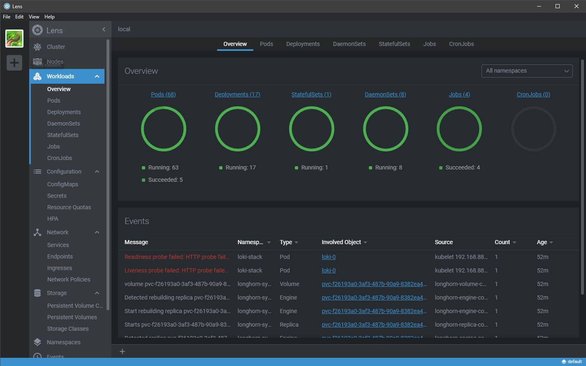

# Lab Cluster

My home lab cluster.

## Building your own

### VM setup

- Setup n VMs / bare metal machines with Ubuntu 18.04. The K8s control plan + etcd nodes should have 1.5 GB memory. I've given the worker nodes 8 GB memory.
- Install docker on each VM. 
```shell 
wget -O - https://raw.githubusercontent.com/just1689/kubernetes-setup-rke/master/setup-node.sh | bash
```
- Create a user on each VM.
- Allow your new user to run `docker x` commands.
```shell
sudo usermod -aG docker $USER
```
- Generate ssh keys with `ssh-key-gen`
- Copy your key over to each vm with `ssh-copy-id user@address`
- Turn swap off on each VM by running `sudo swapoff -a`
- To allow for cleaning up as root, setup cert base ssh access to root to each VM. You may not need this. It's only for recovering from unsupported upgrade paths etc. 

### Installing Kubernetes

Modify the `cluster.yml` by changing the entries under `nodes`. Pay particular attention to the IP addresses, the user field and the roles.

Once the cluster.yml file reflects your desired cluster configuration run:
```bash
rke up
```

- Once it is up you will find a new file called `kube_config_cluster.yml`
- Overwrite your home kube config with the following command `cp kube_config_cluster.yml ~/.kube/config`
- You will then be able to run `kubectl get nodes` and see the nodes.

### Installing Apps


Longhorn
```shell
kubectl apply -f apps/01-longhorn/ 
```


Prometheus
```shell
kubectl apply -f apps/02-prometheus/ 
```


Grafana
```shell
kubectl apply -f apps/03-grafana/ 
```


Loki
```shell
kubectl apply -f apps/04-loki/ 
```

### Lens

Lens can show you the cluster health of the nodes.


Lens can also show the health of your workloads. You can watch this space to see the  various lab apps come up.




 
 